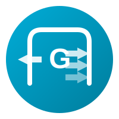

<p align="center">
  
</p>

<h1 align="center">GoGate</h1>

<p align="center">
  <strong>High-Performance L4/L7 Proxy & API Gateway</strong><br>
  <em>Built with Go for production workloads</em>
</p>

<p align="center">
  <a href="https://github.com/abd-ulbasit/gogate/actions"></a>
  <a href="https://goreportcard.com/report/github.com/abd-ulbasit/gogate"></a>
  <a href="https://pkg.go.dev/github.com/abd-ulbasit/gogate"></a>
  <a href="LICENSE"></a>
</p>

<p align="center">
  <a href="#features">Features</a> •
  <a href="#quick-start">Quick Start</a> •
  <a href="#architecture">Architecture</a> •
  <a href="#configuration">Configuration</a> •
  <a href="#deployment">Deployment</a> •
  <a href="#observability">Observability</a>
</p>

---

## Overview

**GoGate** is a production-ready L4/L7 proxy and API gateway built in Go. It combines raw TCP proxying with HTTP reverse proxy capabilities, supporting modern traffic management patterns like circuit breakers, rate limiting, traffic splitting, and service discovery.

### Why GoGate?

- 🚀 **High Performance** - Zero-allocation hot paths, connection pooling, efficient goroutine management
- 🔄 **Dual Layer Support** - L4 (TCP) and L7 (HTTP) proxying in a single binary
- 🛡️ **Resilience Built-in** - Circuit breakers, rate limiting, health checks, graceful degradation
- 📊 **Observable** - Prometheus metrics, structured logging, distributed tracing support
- ☸️ **Cloud Native** - Kubernetes-ready with Helm charts, ServiceMonitor, and health endpoints
- 🔧 **Minimal Dependencies** - Pure Go implementation, single binary deployment

## Features

### Traffic Management
| Feature | Description |
|---------|-------------|
| **Load Balancing** | Round-robin, weighted round-robin, least-connections algorithms |
| **Health Checks** | Active TCP/HTTP health probes with configurable thresholds |
| **Rate Limiting** | Token bucket algorithm with burst support |
| **Circuit Breaker** | Three-state pattern (closed/open/half-open) with automatic recovery |
| **Traffic Splitting** | Weighted distribution for canary deployments and A/B testing |

### Protocol Support
| Layer | Capabilities |
|-------|-------------|
| **L4 (TCP)** | Raw TCP proxying, connection tracking, half-close support |
| **L7 (HTTP)** | Reverse proxy, path/host routing, header manipulation, middleware chain |

### Security
- JWT authentication with claims validation
- CORS middleware with preflight handling
- Request ID propagation for tracing
- TLS termination support

### Operations
- Hot reload via fsnotify
- Graceful shutdown with connection draining
- Service discovery with TTL-based registration
- Admin API for runtime inspection

## Quick Start

### Using Docker (Recommended)

```bash
# Pull and run
docker run -p 8080:8080 -p 8081:8081 -p 9090:9090 \
  ghcr.io/abd-ulbasit/gogate:latest

# With custom config
docker run -p 8080:8080 -p 8081:8081 -p 9090:9090 \
  -v $(pwd)/config.yaml:/etc/gogate/config.yaml \
  ghcr.io/abd-ulbasit/gogate:latest
```

### Using Docker Compose

```bash
# Clone the repository
git clone https://github.com/abd-ulbasit/gogate.git
cd gogate

# Start full stack (proxy + backends + Prometheus + Grafana)
docker-compose -f deployments/docker/docker-compose.yaml up -d

# View logs
docker-compose -f deployments/docker/docker-compose.yaml logs -f gogate
```

### From Source

```bash
# Build
go build -o bin/gogate ./cmd/gogate

# Run
./bin/gogate -config config.yaml
```

### Verify Installation

```bash
# Check health
curl http://localhost:9090/health

# View backends
curl http://localhost:9090/backends

# Test proxy (HTTP)
curl http://localhost:8081/

# Test proxy (TCP via netcat)
echo "hello" | nc localhost 8080
```

## Architecture

```
┌──────────────────────────────────────────────────────────────────────────────┐
│                                   GoGate                                      │
│                                                                              │
│  ┌─────────────┐     ┌──────────────────┐     ┌─────────────────────────┐   │
│  │  Listeners  │────▶│ Protocol Router  │────▶│    Processing Layer     │   │
│  │ TCP / HTTP  │     │  (L4 vs L7)      │     │                         │   │
│  └─────────────┘     └──────────────────┘     │  ┌───────────────────┐  │   │
│                                               │  │   Middleware      │  │   │
│                                               │  │  ├─ Rate Limiter  │  │   │
│                                               │  │  ├─ Circuit Brk   │  │   │
│                                               │  │  ├─ JWT Auth      │  │   │
│                                               │  │  └─ Tracing       │  │   │
│                                               │  └───────────────────┘  │   │
│                                               └────────────┬────────────┘   │
│                                                            │                │
│  ┌─────────────────────────────────────────────────────────┼────────────┐   │
│  │                     Traffic Management                  │            │   │
│  │  ┌──────────────┐  ┌──────────────┐  ┌─────────────┐   │            │   │
│  │  │ Load Balancer│  │Health Checker│  │Traffic Split│◀──┘            │   │
│  │  │ RR/WRR/LC    │  │ TCP/HTTP     │  │ Canary/A-B  │                │   │
│  │  └──────┬───────┘  └──────────────┘  └─────────────┘                │   │
│  └─────────┼───────────────────────────────────────────────────────────┘   │
│            │                                                                │
│  ┌─────────┼───────────────────────────────────────────────────────────┐   │
│  │         ▼           Service Registry                                │   │
│  │  ┌────────────┐   ┌────────────┐   ┌────────────┐                   │   │
│  │  │ Backend A  │   │ Backend B  │   │ Backend C  │ ◀─ Dynamic        │   │
│  │  │ weight: 5  │   │ weight: 3  │   │ weight: 1  │    Registration   │   │
│  │  └────────────┘   └────────────┘   └────────────┘                   │   │
│  └──────────────────────────────────────────────────────────────────────┘   │
└──────────────────────────────────────────────────────────────────────────────┘
                                    │
                    ┌───────────────┼───────────────┐
                    ▼               ▼               ▼
             ┌──────────┐   ┌──────────┐   ┌──────────┐
             │ Backend  │   │ Backend  │   │ Backend  │
             │ Service  │   │ Service  │   │ Service  │
             └──────────┘   └──────────┘   └──────────┘
```

## Configuration

GoGate uses YAML configuration. See [config.example.yaml](config.example.yaml) for full reference.

### Minimal Configuration

```yaml
server:
  listenAddr: ":8080"      # L4 TCP proxy
  httpListenAddr: ":8081"  # L7 HTTP proxy
  
  backends:
    - addr: "localhost:9001"
    - addr: "localhost:9002"
  
  loadBalancer: "round_robin"

logging:
  level: "info"
  format: "json"
```

### Production Configuration

```yaml
server:
  listenAddr: ":8080"
  httpListenAddr: ":8081"
  
  backends:
    - addr: "backend-1:8080"
      weight: 5
    - addr: "backend-2:8080"
      weight: 3
    - addr: "backend-canary:8080"
      weight: 1
  
  loadBalancer: "weighted_round_robin"
  
  health:
    interval: 10s
    timeout: 2s
    unhealthyThreshold: 3
    healthyThreshold: 2
    checkType: "http"
    httpPath: "/health"
  
  rateLimit:
    enabled: true
    rate: 1000      # requests per second
    burst: 100      # burst allowance
  
  circuitBreaker:
    enabled: true
    failureThreshold: 5
    successThreshold: 2
    timeout: 30s
  
  admin:
    enabled: true
    listenAddr: ":9090"
  
  metrics:
    enabled: true
    listenAddr: ":9091"
  
  tcpPool:
    enabled: true
    maxIdle: 10
    idleTimeout: 60s

logging:
  level: "info"
  format: "json"
```

## Deployment

### Kubernetes with Helm

```bash
# Add values override
cat > values-override.yaml <<EOF
replicaCount: 3

backends:
  - addr: "my-service:8080"
    weight: 1

serviceMonitor:
  enabled: true

autoscaling:
  enabled: true
  minReplicas: 2
  maxReplicas: 10
EOF

# Install
helm install gogate ./deployments/helm/gogate \
  -f values-override.yaml \
  --namespace gogate \
  --create-namespace

# Upgrade
helm upgrade gogate ./deployments/helm/gogate \
  -f values-override.yaml \
  --namespace gogate
```

### Docker Compose (Development)

```bash
cd deployments/docker
docker-compose up -d

# Access:
# - GoGate HTTP: http://localhost:8081
# - GoGate TCP:  localhost:8080
# - Admin API:   http://localhost:9090
# - Prometheus:  http://localhost:9092
# - Grafana:     http://localhost:3000 (admin/admin)
```

## Observability

### Prometheus Metrics

GoGate exposes metrics at `:9091/metrics`:

```
# Request metrics
gogate_requests_total{backend="backend-1",status="success"}
gogate_request_duration_seconds{quantile="0.99"}

# Backend health
gogate_backend_healthy{backend="backend-1"} 1
gogate_backend_connections_active{backend="backend-1"} 42

# Circuit breaker
gogate_circuit_breaker_state{backend="backend-1"} 0  # 0=closed, 1=open, 2=half-open

# Rate limiter
gogate_rate_limit_rejected_total
```

### Admin API Endpoints

| Endpoint | Description |
|----------|-------------|
| `GET /health` | Health check (for K8s probes) |
| `GET /stats` | Detailed proxy statistics |
| `GET /backends` | List all backends with status |
| `POST /backends/:id/drain` | Drain backend for maintenance |

### Structured Logging

```json
{
  "time": "2024-01-15T10:30:00Z",
  "level": "INFO",
  "msg": "request completed",
  "method": "GET",
  "path": "/api/users",
  "status": 200,
  "duration_ms": 42,
  "backend": "backend-1",
  "request_id": "abc-123"
}
```

## Load Testing

```bash
# Install k6
brew install k6

# Run load test
k6 run k6/load-test.js

# Run specific scenarios
k6 run --env SCENARIO=spike k6/load-test.js

# Rate limiter stress test
k6 run k6/rate-limit-test.js

# Soak test (long duration)
k6 run --duration 1h k6/soak-test.js
```

## API Reference

### Service Registration (When service discovery is enabled)

```bash
# Register service
curl -X POST http://localhost:9090/v1/services \
  -H "Content-Type: application/json" \
  -d '{
    "id": "my-service-1",
    "name": "my-service",
    "address": "10.0.0.5:8080",
    "tags": ["v2", "canary"],
    "ttl": "30s"
  }'

# Heartbeat (keep-alive)
curl -X PUT http://localhost:9090/v1/services/my-service-1/heartbeat

# Deregister
curl -X DELETE http://localhost:9090/v1/services/my-service-1
```

## Performance

Benchmarks on Apple M1 Pro (10 cores):

| Metric | Value |
|--------|-------|
| TCP Throughput | ~51μs/op |
| HTTP Latency (p99) | <5ms |
| Concurrent Connections | 10,000+ |
| Memory (idle) | ~15MB |
| Memory (10k conn) | ~50MB |

## Development

```bash
# Run tests
go test ./... -v

# Run with race detector
go test ./... -race

# Run benchmarks
go test ./... -bench=. -benchmem

# Build
go build -o bin/gogate ./cmd/gogate

# Run locally
./bin/gogate -config config.yaml
```

See [README.dev.md](README.dev.md) for detailed development notes and milestone progress.

## Project Structure

```
gogate/
├── cmd/gogate/          # Main application entry point
├── internal/
│   ├── backend/         # Backend abstraction & connection pooling
│   ├── circuitbreaker/  # Circuit breaker implementation
│   ├── config/          # Configuration loading & validation
│   ├── health/          # Health checker (TCP/HTTP probes)
│   ├── loadbalancer/    # LB algorithms (RR, WRR, LC)
│   ├── metrics/         # Metrics collector & Prometheus
│   ├── middleware/      # HTTP middleware chain
│   ├── observability/   # Structured logging
│   ├── proxy/           # L4 TCP & L7 HTTP proxy
│   ├── ratelimiter/     # Token bucket rate limiter
│   ├── registry/        # Service discovery registry
│   ├── router/          # HTTP path/host router
│   └── splitter/        # Traffic splitting
├── deployments/
│   ├── docker/          # Docker & Compose files
│   └── helm/            # Kubernetes Helm chart
├── k6/                  # Load test scripts
└── docs/                # Additional documentation
```

## Contributing

Contributions welcome! Please read the contributing guidelines first.

1. Fork the repository
2. Create a feature branch (`git checkout -b feature/amazing-feature`)
3. Commit changes (`git commit -m 'Add amazing feature'`)
4. Push to branch (`git push origin feature/amazing-feature`)
5. Open a Pull Request

## License

MIT License - see [LICENSE](LICENSE) for details.

## Acknowledgments

- Inspired by [HAProxy](https://www.haproxy.org/), [Envoy](https://www.envoyproxy.io/), and [Traefik](https://traefik.io/)
- Built as a learning project for Go systems programming
- Thanks to the Go community for excellent documentation and tooling

---

<p align="center">
  Made with ☕ and Go
</p>
